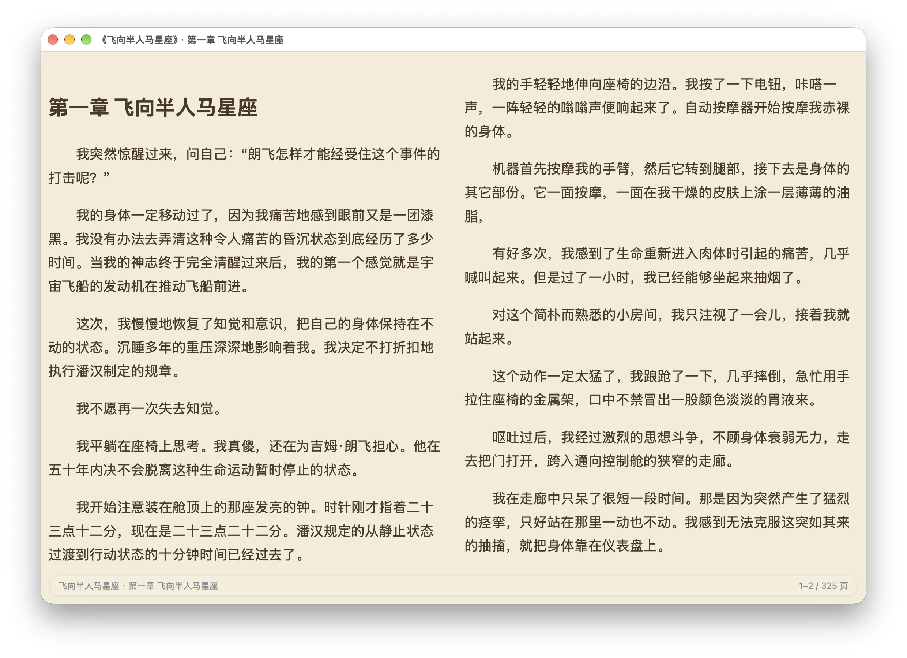

# SnackRead

A local manga / e-book reader for images, PDF and EPUB, built with Tauri 2
(Rust backend + system WebView). It is the GUI companion of the cshow terminal
reader, focused on a buttery-smooth reading experience for long strips
(条漫), multi-volume comics and text-heavy EPUBs.

本地漫画 / 电子书阅读器，基于 Tauri 2（Rust 后端 + 系统 WebView），专注图片、
PDF、EPUB 的丝滑阅读体验，是 cshow 终端阅读器的 GUI 版。

---

## Screenshots / 截图

<div align="center">

| 书库 | 阅读 |
| --- | --- |
| <a href="screenshots/library-ebooks.png"></a> | <a href="screenshots/library-manga.png"></a> |
| <sub>电子书书库 · 网格、标签、评分、阅读统计</sub> | <sub>漫画书库</sub> |
| <a href="screenshots/library-ebooks-selected.png"></a> | <a href="screenshots/manga-reader.png"></a> |
| <sub>电子书书库 · 选中书籍高亮</sub> | <sub>漫画翻页阅读 · 双页，条漫卷</sub> |
| <a href="screenshots/text-reader.png"></a> | |
| <sub>文字书双页阅读 · 羊皮纸主题</sub> | |

点击任意截图可查看原图。本地优先，阅读全程离线。

</div>

---

## Features / 功能特性

### Library / 书库

- Add any local folder as a library; multiple libraries are arranged as tabs,
  switch with `Tab` / `Shift+Tab` in the grid view.
  把本地文件夹添加为书库，多个书库以 Tab 排列，网格视图下用 `Tab` / `Shift+Tab` 切换。
- Book cards with cover thumbnails, progress donut, tags, rating, notes and
  reading statistics (time read, recent books).
  书卡包含封面缩略图、进度圆环、标签、评分、备注与阅读统计（时长、最近在读）。
- Metadata editor with an **AI Fill** button: sends the book title/author to a
  fixed `deepseek-v4-flash` model, parses its JSON (title, author, platform,
  ratings, tags, core setting, synopsis), and fills the form — ratings are
  converted to the app's 5-star scale (publishing platform preferred). The
  DeepSeek API key is entered in the Library Manager dialog under "AI 设置"
  (stored in `app_state`, used locally only); notes may contain Markdown
  (bold / line breaks) rendered on card hover; always review before saving.
  元数据编辑支持「AI填入」：把书名/作者发给固定模型 `deepseek-v4-flash`，
  解析返回的 JSON（书名、作者、平台、评分、标签、核心设定、梗概）回填表单；
  评分统一换算为应用的五星值（发表平台优先）。DeepSeek API Key 在「书库管理」的
  「AI 设置」里录入，只存本机数据库；备注支持 Markdown（加粗/换行等），悬停书卡时渲染；
  保存前建议人工核对。
- Tag filter bar: multi-select uses **AND** (a book must have every selected
  tag); tags are sorted by how many books reference them (most-used first);
  globally only tags used by ≥ 2 books are shown, but once a filter is active
  the bar switches to the available tag set of the current result (including
  single-use tags) so you can keep narrowing down.
  标签筛选：多选为 **AND**（交集，需同时包含所有选中标签）；标签按被引用次数从多到少排序；
  全局只显示被 ≥2 本书引用的标签；选中筛选后标签栏切换为当前结果的可用标签合集
  （只被一本书引用的标签也会显示），方便继续收窄。
- **Repair TOC** (修复目录) in the metadata dialog: detects EPUBs whose NCX
  anchors all point at the first file (common in Z-Library conversions) and
  rewrites the book into one file per chapter — OPF spine + NCX rebuilt,
  original file backed up to `backups/` before replacing.
  元数据对话框的「修复目录」：检测 NCX 锚点全部指向首文件的坏书（Z-Library 转换常见），
  重写为每章一文件（OPF spine + NCX 重建），替换前原文件自动备份到 `backups/`。
- Eye toggle hides/shows flagged folders; password-protected libraries are
  supported (eye password).
  eye 按钮隐藏/显示被标记的文件夹；支持带密码的书库。
- Loose EPUB/PDF files at the library root open directly; folder-based
  multi-volume books open into a volume grid.
  书库根目录的散装 EPUB/PDF 直接进入阅读；文件夹形式的多卷书进入卷页网格。

### Reading / 阅读

- **Images & PDF**: vertical strip (条漫) scrolling by default; PDF rendered
  with pdf.js.
  **图片 / PDF**：默认纵向条漫滚动；PDF 用 pdf.js 渲染。
- **EPUB**: auto-detects image-comics vs text books. Image books paginate
  page images; text books get a full reader (see below).
  **EPUB**：自动识别图像书与文字书。图像书按页提取图片分页；文字书进入完整阅读器（见下）。
- **Flip mode** (翻页): horizontal pagination with single/double page,
  RTL support, trackpad horizontal swipe with threshold + cooldown.
  **翻页模式**：横向分页，支持单页/双页、右开（RTL）、触控板横向滑动（带阈值与冷却防误翻）。
- Per-book reading mode / page mode / RTL remembered.
  阅读模式 / 单双页 / 右开按书记忆。

### Text-book reader / 文字书阅读器

- **On-demand chapter loading**: only the current chapter ± 1 is loaded;
  chapters load and measure when you page into them, far chapters are unloaded
  (page counts are estimated from characters until measured).
  **按需加载**：只加载当前章 ± 1 章，跨章时再加载/测量，远离窗口的章节会被卸载；
  未加载章节按字符量估算页数，测量后逐步精确。
- Scroll (长文) and flip (CSS multi-column) modes; flip supports single/double
  page, all with smooth 300ms easing transitions for chapter-internal and
  cross-chapter paging.
  滚动（长文）与翻页（CSS 多列）两种模式；翻页支持单/双页，章节内与跨章翻页均为
  300ms 缓动滑动过渡。
- Per-book font size / family (system / serif / sans); theme (light / sepia /
  dark); font changes keep the reading position via content percentage.
  字号 / 字体（系统 / 宋体 / 黑体）按书记忆；主题（白 / 羊皮纸 / 暗）；
  调整字号后按内容百分比保持在原位置。
- Table of contents with in-file anchors (NCX `#filepos`), so one-file-many-
  chapters books jump to the exact chapter.
  目录支持文件内锚点（NCX `#filepos`），一文件多章的书可精确跳到指定章节。
- Fixed headers/footers from PDF-converted EPUBs (`Page | 123`, repeated
  "book – author" lines) are detected at unpack time and hidden.
  解包时自动检测并隐藏 PDF 转换 EPUB 的固定页眉/页脚（`Page | 123`、重复的“书名 – 作者”）。
- Reading position is anchored to **content percentage** (chapter character
  weights), consistent across scroll/flip and independent of window size/font.
  阅读位置按**内容百分比**锚定（按章节字符量加权），滚动/翻页统一，不受窗口尺寸/字号影响。
- Loading overlay + progress bar on entry and mode switches (no layout flash).
  进入阅读与模式切换时显示加载遮罩 + 进度条（无布局闪烁）。

### Data & cache / 数据与缓存

- All state lives in a single SQLite database; old `.cshow` / favorites /
  config files are migrated once and removed (with a backup).
  全部状态收敛到单一 SQLite 数据库；旧 `.cshow` / favorites / 配置文件一次性迁移
  （保留备份后删除）。
- EPUB unpack cache and thumbnails are keyed by content (path + size + mtime +
  schema version); orphan caches are garbage-collected on startup.
  EPUB 解包缓存与缩略图按内容指纹（路径 + 大小 + mtime + 结构版本）缓存；
  启动时自动清理孤儿缓存。

---

## Architecture / 架构

```
┌──────────────────────────── Tauri 2 ────────────────────────────┐
│  ui/ (static web)                    src-tauri/ (Rust backend)  │
│  ┌──────────────┐   invoke / events   ┌──────────────────────┐  │
│  │ app.js       │ ◄─────────────────► │ lib.rs               │  │
│  │  library grid│                     │  scan / unpack EPUB  │  │
│  │  reader      │  book:// protocol   │  SQLite (db.rs)      │  │
│  │  reader.js*  │ ◄─────────────────► │  thumbnails / cache  │  │
│  └──────────────┘   iframe postMessage └──────────────────────┘  │
└──────────────────────────────────────────────────────────────────┘
```

*`reader.js` / `reader.css` are injected into each text-book chapter and served
from the binary via `book://`, so reader fixes apply without re-unpacking.
*`reader.js` / `reader.css` 注入到文字书每个章节，经 `book://` 协议从二进制内嵌
提供——修复阅读器无需重新解包。

### Backend / 后端 (`src-tauri/`)

- `lib.rs` — directory scanning, library management, EPUB unpacking (OPF /
  spine / NCX / cover, text-vs-image detection, header/footer detection,
  in-file TOC anchors), thumbnail & position caches, migration, AI metadata
  via DeepSeek API (`smart_fetch_meta`, API key get/set), and the `book://`
  protocol that serves unpacked EPUB files.
  目录扫描、书库管理、EPUB 解包（OPF / spine / NCX / 封面、文字/图像书判定、
  页眉页脚检测、目录锚点）、缩略图与位置缓存、迁移、DeepSeek API 的 AI 元数据
  （`smart_fetch_meta`、API Key 读写），以及服务解包文件的 `book://` 协议。
- `db.rs` — SQLite layer: schema, CRUD, cascading deletes, schema migrations.
  SQLite 层：建表、增删改查、级联删除、结构迁移。
- Commands are short transactions on a single `Mutex<Connection>`.
  命令基于单个 `Mutex<Connection>` 的短事务。

### Frontend / 前端 (`ui/`)

- `app.js` — single-page app: library grid (always-on icon mode), volume
  pages, strip/flip readers, text-book state machine (on-demand loading,
  geometry measurement, progress anchoring), TOC panel, dialogs.
  单页应用：书库网格（始终图标模式）、卷页、条漫/翻页阅读、文字书状态机
  （按需加载、几何测量、进度锚定）、目录面板、各类对话框。
- `reader.js` — runs inside each text chapter iframe: theming, font control,
  CSS multi-column pagination, smooth paging, anchor jumps.
  运行在文字书章节 iframe 内：主题、字体控制、CSS 多列分页、平滑翻页、锚点跳转。
- `index.html` / `style.css` — minimal DOM and design tokens.
  极简 DOM 与设计令牌。

### Data model / 数据模型 (SQLite `library.sqlite3`)

| Table | Purpose / 用途 |
| --- | --- |
| `libraries` | Library folders, alias, sort order, hidden, eye password |
| `books` | Per-book metadata, tags, rating, note, reading time, last-read volume |
| `positions` | Per-volume reading position (page/mode/finished/progress) |
| `settings` | Per-book reading mode / RTL / double page / font size & family / theme |
| `app_state` | Global state: cwd, window size, default font & theme, DeepSeek API key |
| `dir_state` | Directory browse position (current file + page) |

### Working directory / 工作目录

Default `~/Documents/cshow-work` (changeable in the library dialog):

- `library.sqlite3` — all persistent state (above).
- `epub/{key}/` — unpacked EPUBs (spine.json + chapters + injected reader).
- `thumbs/v2/{key}.png` — cover/page thumbnails (360px).
- `backups/` — original EPUBs saved before in-app TOC repair.
  `backups/` — 应用内「修复目录」替换前的原书备份。

---

## Development / 开发

```sh
cd src-tauri
cargo run -- [起始目录 / start directory]
```

Without an argument the app restores the last directory; if it is not inside
a library it opens the first library.
不传参数时恢复上次目录；目录不在书库中时自动进入第一个书库。

### Packaging / 打包

```sh
scripts/package.sh
```

Release build → assemble `.app` → ad-hoc sign → zip → copy to
`/Applications/SnackRead.app`. The app renames to **SnackRead**, but the
binary is `snack-read` (crate name). Version lives in `src-tauri/Cargo.toml`
and is bumped per round of changes.
release 编译 → 组装 `.app` → ad-hoc 签名 → zip → 复制到
`/Applications/SnackRead.app`。应用名（显示名）为 **SnackRead**，但可执行文件
仍为 `snack-read`（crate 名）。版本号在 `src-tauri/Cargo.toml`，每轮修改递增。

> 包标识符 `com.cherno.cshow-gui` 与配置目录 `~/Library/Application Support/cshow-gui`
> 刻意保持旧值，以确保既有身份/用户数据不变。

> 打包版本取自 `src-tauri/Cargo.toml`；`src-tauri/tauri.conf.json` 的 `version`
> 应在每次提版时同步（`package.sh` 实际只读 `Cargo.toml`）。

### Tests / 测试

```sh
cd src-tauri && cargo test
```

Rust unit tests cover EPUB parsing (OPF in subdir, SVG covers, TOC anchors),
text/image detection, header/footer detection, DB round-trips and schema
migrations, plus AI metadata helpers (OPF extraction, LLM JSON parsing,
rating conversion to 5-star; a live DeepSeek call is opt-in via env vars).
Rust 单元测试覆盖 EPUB 解析（子目录 OPF、SVG 封面、目录锚点）、文字/图像判定、
页眉页脚检测、数据库往返与结构迁移，以及 AI 元数据辅助（OPF 提取、LLM JSON 解析、
评分五星换算；真实 DeepSeek 调用可通过环境变量开启）。

---

## Project structure / 目录结构

```
src-tauri/
  src/main.rs        entry / --version
  src/lib.rs         backend logic, commands, book:// protocol
  src/db.rs          SQLite layer
  tauri.conf.json    app config (frontend = ../ui)
  Cargo.toml         version + dependencies
ui/
  index.html         single page shell
  app.js             all app logic (grid, reader, text-book state machine)
  reader.js/css      injected text-book reader (served from binary)
  style.css          design tokens + layout
  vendor/pdfjs/      PDF rendering
scripts/
  package.sh         release build / sign / zip / install to /Applications
```

## Keyboard shortcuts / 快捷键

- `Esc` / `q` — exit reading / go back one level
- `Tab` / `Shift+Tab` — switch libraries in grid view
- `←` / `→` / `PageUp` / `PageDown` / `Space` — page or scroll
- `t` — flip-mode RTL (← advances)
- `A−` / `A+` — font size; 字体 button — system/serif/sans

---

> Note: this is a local-first app — all files are served locally through the
> Tauri asset protocol; reading itself never touches the network. The only
> online feature is the optional "AI Fill" metadata command, which calls the
> DeepSeek API with your own key.
> 说明：本地优先应用——所有文件经 Tauri asset 协议本地提供，阅读本身不联网；
> 唯一联网功能是可选的「AI填入」元数据命令，用你自己的 Key 调用 DeepSeek API。
